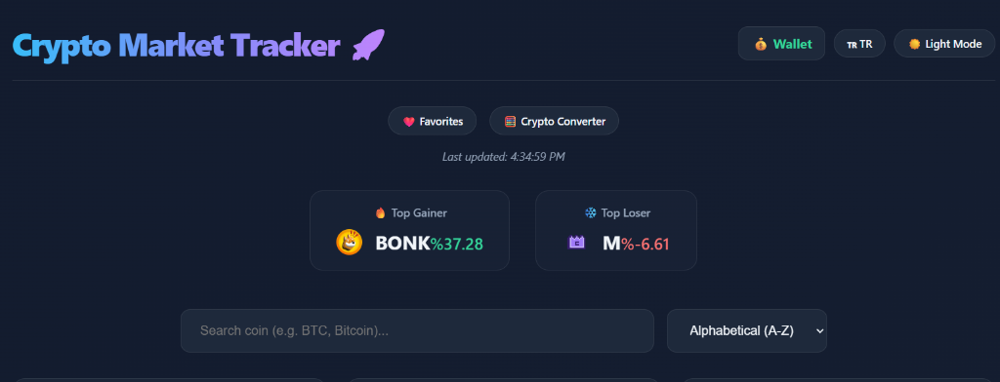
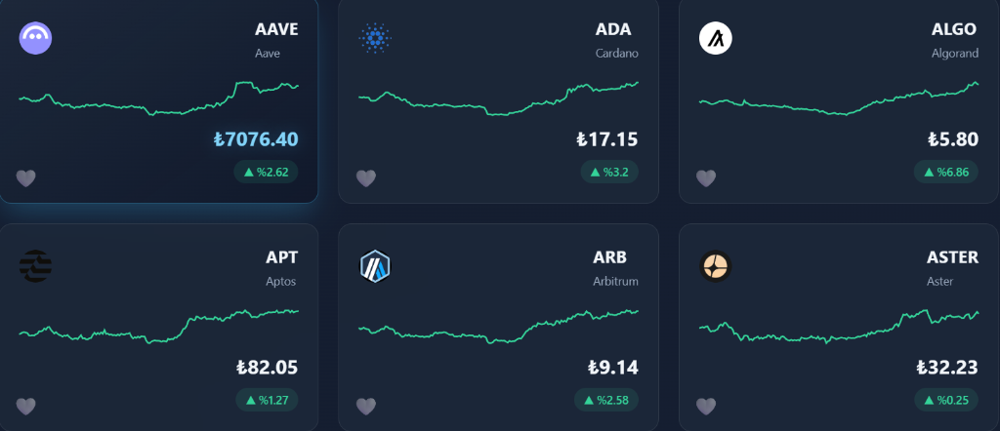
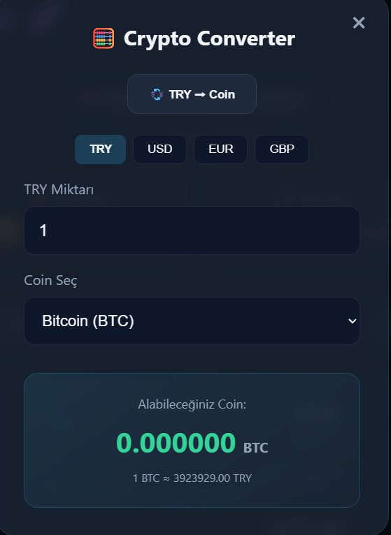
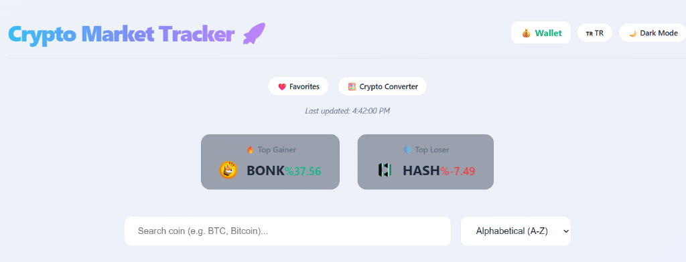

# 🚀 Crypto Market Tracker (BTE313 Final Project)

Developed as part of the BTE313 course final project at Hacettepe University, this React-based web application allows users to track real-time cryptocurrency data.

**Developer:** Sefa Usta

## 🌟 Features

- **Real-Time Market Data:** Live price, change percentage, and volume data for 100+ cryptocurrencies via CoinGecko API.
- **Detailed Analysis:** Pop-up modal for each coin showing 24h High/Low, Market Cap, and a virtual Buy/Sell interface.
- **📈 Sparkline Charts:** Mini charts displaying the 7-day price trend for each coin.
- **❤️ Favorites:** Watchlist functionality to track favorite coins (Persisted via LocalStorage).
- **💰 Virtual Wallet:** A simulation environment with a starting balance of 100,000 TL to practice trading without risk. Includes portfolio tracking.
- **🧮 Crypto Converter:** An instant calculation tool for converting between TRY, USD, EUR, GBP and cryptocurrencies.
- **🔔 Price Alerts:** Set custom price targets and receive toast notifications when the price hits the target.
- **Theme Support:** Toggle between Light and Dark modes.
- **Language Support:** Bilingual support for Turkish (TR) and English (EN).

## 🛠 Technologies Used

- **React:** Component-based UI architecture.
- **Vite:** Fast development and build tool.
- **CoinGecko API:** Reliable cryptocurrency data provider.
- **CSS3:** Custom, responsive, modern design with Glassmorphism effects.
- **LocalStorage:** Client-side persistence for user preferences, wallet balance, and portfolio.

## � Screenshots

### Dashboard (Dark Mode)

### Coin Detail & Sparkline Charts

### Crypto Converter Tool

### Light Mode

